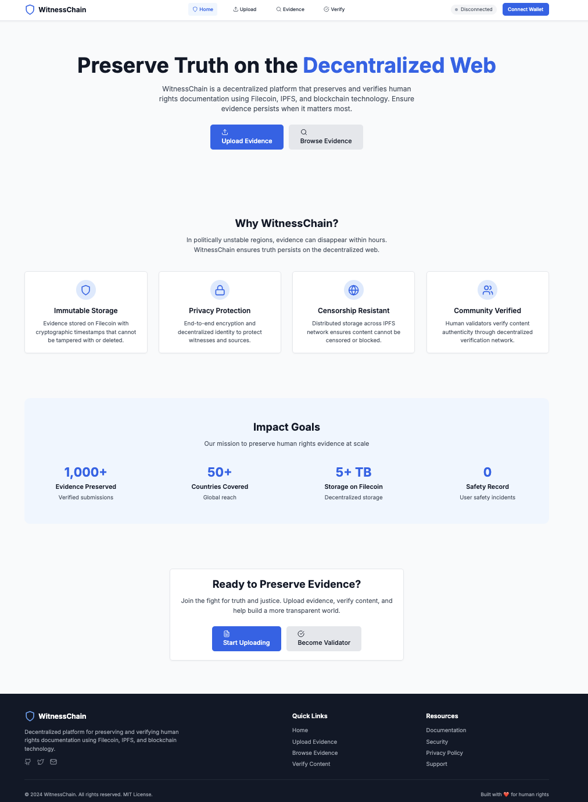
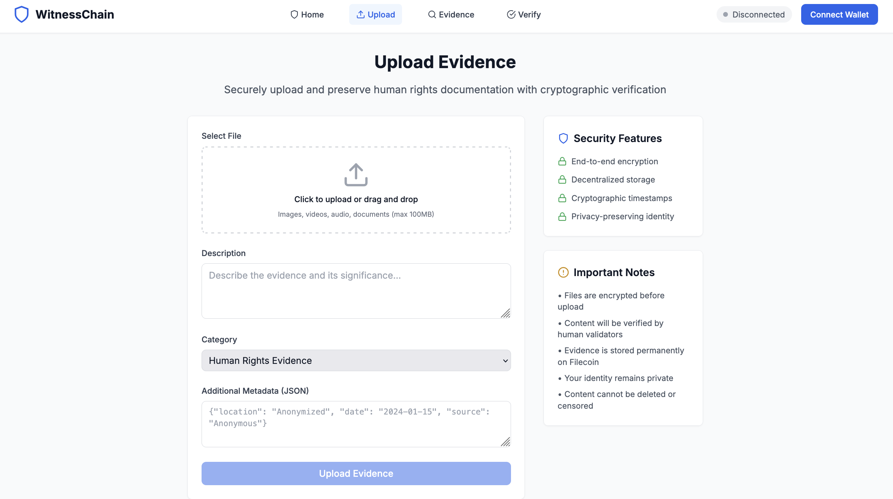

# WitnessChain

**Decentralized Human Rights Evidence Platform**

WitnessChain is an open-source project that aims to preserve and verify human rights documentation using Filecoin, IPFS, Drand, DIDs, and privacy-preserving networking (libp2p). This repo contains the proposal, roadmap, architecture notes, and a starter MVP skeleton (backend + frontend) for community contribution.

## 📸 WitnessChain in Action


*The WitnessChain homepage showcasing the main mission and user interface*


*Secure evidence upload interface with privacy protection features*

[](https://opensource.org/licenses/MIT)
[](https://github.com/Hany-Almnaem/witnesschain/actions)
[](https://github.com/Hany-Almnaem/witnesschain/discussions)

## 🎯 Mission

In politically unstable regions and conflict zones, critical evidence of human rights violations is frequently deleted, manipulated, or suppressed. WitnessChain provides immutable, decentralized storage that can't be censored or manipulated, ensuring truth persists on the decentralized web.

## 🚀 Quick Links

- **[📋 Full Proposal](docs/PROPOSAL.md)** - Complete project overview and technical specifications
- **[🗺️ Roadmap](docs/ROADMAP.md)** - Development phases and timeline
- **[🏗️ Architecture](docs/ARCHITECTURE.md)** - Technical architecture overview
- **[🔒 Security](docs/SECURITY.md)** - Security considerations (coming soon)
- **[❓ FAQ](docs/FAQ.md)** - Frequently asked questions

## 🛠️ Getting Started (Development)

### Prerequisites

- Node.js (v18 or higher)
- npm or yarn
- Git

### Backend Development

```bash
cd packages/backend
npm install
npm run dev
# Backend runs on http://localhost:3000
```

### Frontend Development

```bash
cd packages/frontend
npm install
npm run dev
# Frontend runs on http://localhost:5173
```

### Full Stack Development

```bash
# Install dependencies for all packages
npm install

# Run backend and frontend concurrently
npm run dev
```

## 🤝 How You Can Help

- **Review the proposal** & leave comments in [Discussions](https://github.com/Hany-Almnaem/witnesschain/discussions)
- **Pick an issue** labeled `good-first-issue` or `help-wanted`
- **Help with FVM prototype**, IPFS integration, or security review
- **Join the conversation** in our GitHub Discussions

## 🏗️ Architecture Overview

WitnessChain leverages:

- **Filecoin Virtual Machine (FVM)** - Smart contracts for immutable timestamps
- **IPFS** - Distributed, censorship-resistant content storage
- **Drand** - Decentralized randomness for secure time beacons
- **DIDs** - Decentralized identity with Storacha integration
- **libp2p** - Secure peer-to-peer communications
- **Zero-knowledge proofs** - Privacy-preserving user identity

## 📈 Impact Goals

- **Year 1:** 1,000+ verified evidence submissions
- **Storage:** 5+ TB of data on Filecoin
- **Coverage:** 50+ countries represented
- **Safety:** Zero user safety incidents
- **Performance:** <2 second retrieval time

## 🔗 Ecosystem Integration

WitnessChain integrates with the Filecoin ecosystem:

- **Protocol Labs** - Technical mentorship and support
- **Filecoin Foundation** - Ecosystem development
- **FVM Community** - Smart contract development
- **IPFS Operators** - Gateway infrastructure
- **Storacha** - Access control solutions
- **Open to Partnerships** - Seeking technical and community support

## 📄 License

MIT License - See [LICENSE](LICENSE) for details.

## 🆘 Support

- **GitHub Issues** - Bug reports and feature requests
- **GitHub Discussions** - Community conversations
- **Security** - Security documentation will be added in future phases

---

*"Truth persists when preserved on the decentralized web."*
