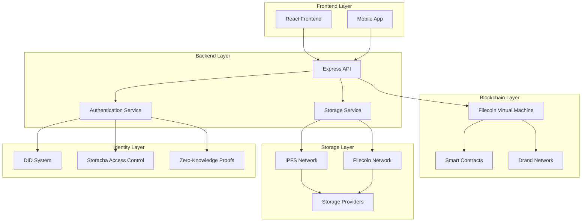

# WitnessChain Architecture

## Overview

WitnessChain is built on a decentralized architecture that leverages Filecoin, IPFS, and other Web3 technologies to create a censorship-resistant platform for preserving human rights evidence. This document outlines the technical architecture, component interactions, and design decisions.

## System Architecture



## Core Components

### 1. Decentralized Storage Layer

#### IPFS Integration
- **Purpose:** Distributed, censorship-resistant content storage
- **Implementation:** 
  - Direct IPFS node integration
  - Web3.storage for simplified access
  - Custom pinning services for redundancy
- **Features:**
  - Content addressing with IPLD
  - Automatic content deduplication
  - Distributed content retrieval
  - Gateway redundancy

#### Filecoin Integration
- **Purpose:** Long-term storage guarantees
- **Implementation:**
  - Filecoin deals for persistent storage
  - Multiple Storage Provider partnerships
  - Automated deal renewal
- **Features:**
  - Guaranteed data persistence
  - Economic incentives for storage
  - Decentralized storage providers
  - Cost-effective long-term storage

### 2. Blockchain Timestamp System

#### Filecoin Virtual Machine (FVM)
- **Purpose:** Immutable timestamps and smart contract logic
- **Implementation:**
  - Solidity smart contracts
  - FVM-compatible contract deployment
  - Gas-efficient operations
- **Features:**
  - Cryptographic proof of existence
  - Immutable timestamp records
  - Chain of custody tracking
  - Multi-signature verification

#### Drand Integration
- **Purpose:** Decentralized randomness and secure time beacons
- **Implementation:**
  - Drand client integration
  - Random validator selection
  - Secure timestamp generation
- **Features:**
  - Decentralized randomness
  - Secure time beacons
  - Validator selection fairness
  - Timestamp verification

### 3. Verification Framework

#### AI Content Analysis
- **Purpose:** Initial content screening and metadata extraction
- **Implementation:**
  - Optional AI/ML integration
  - Content analysis APIs
  - Metadata extraction tools
- **Features:**
  - Content classification
  - Duplicate detection
  - Metadata extraction
  - Content quality assessment

#### Human Validator Network
- **Purpose:** Human verification of content authenticity
- **Implementation:**
  - Validator onboarding system
  - Multi-signature approval process
  - Reputation-based selection
- **Features:**
  - Decentralized verification
  - Reputation tracking
  - Multi-layer validation
  - Dispute resolution

### 4. Privacy & Security Layer

#### Decentralized Identity (DID)
- **Purpose:** Privacy-preserving user identity
- **Implementation:**
  - DID document management
  - Storacha integration
  - Identity verification protocols
- **Features:**
  - Pseudonymous identity
  - User-controlled data
  - Privacy-preserving authentication
  - Identity portability

#### Zero-Knowledge Proofs
- **Purpose:** Privacy-preserving verification
- **Implementation:**
  - ZK-SNARK integration
  - Privacy-preserving proofs
  - Selective disclosure
- **Features:**
  - Identity verification without exposure
  - Privacy-preserving validation
  - Selective information disclosure
  - Cryptographic privacy

#### End-to-End Encryption
- **Purpose:** Secure data transmission and storage
- **Implementation:**
  - libp2p-crypto integration
  - Client-side encryption
  - Secure key management
- **Features:**
  - Data encryption at rest
  - Encrypted transmission
  - User-controlled keys
  - Forward secrecy

### 5. Incentive Mechanism

#### FRC-20 Token System
- **Purpose:** Economic incentives for participation
- **Implementation:**
  - Native FVM token
  - ERC-20 compatible interface
  - Token distribution mechanisms
- **Features:**
  - Reward distribution
  - Staking mechanisms
  - Governance participation
  - Economic incentives

#### Validator Rewards
- **Purpose:** Incentivize honest validation
- **Implementation:**
  - Reputation-based rewards
  - Staking mechanisms
  - Slashing conditions
- **Features:**
  - Performance-based rewards
  - Stake-based selection
  - Penalty mechanisms
  - Long-term incentives

## Data Flow Architecture

### Upload Process
1. **User Authentication:** DID-based identity verification
2. **Content Encryption:** Client-side encryption before upload
3. **IPFS Storage:** Content stored on IPFS network
4. **Filecoin Deal:** Long-term storage deal creation
5. **Timestamp Creation:** FVM timestamp with Drand randomness
6. **Verification Queue:** Content added to verification pipeline

### Verification Process
1. **AI Analysis:** Optional content analysis and metadata extraction
2. **Validator Assignment:** Random validator selection based on reputation
3. **Multi-Signature Approval:** Multiple validators verify content
4. **Reputation Update:** Validator reputation updated based on performance
5. **Final Approval:** Content marked as verified with cryptographic proof

### Retrieval Process
1. **Access Control:** Storacha-based permission verification
2. **Content Retrieval:** IPFS content retrieval
3. **Verification Check:** Blockchain verification of authenticity
4. **Decryption:** Client-side decryption of content
5. **Delivery:** Secure content delivery to authorized users

## Security Architecture

### Threat Model
- **Censorship Resistance:** Distributed storage prevents content removal
- **Data Integrity:** Cryptographic proofs ensure content authenticity
- **Privacy Protection:** Zero-knowledge proofs protect user identity
- **Sybil Resistance:** Reputation system prevents validator attacks
- **Economic Security:** Staking mechanisms prevent malicious behavior

### Security Measures
- **Encryption:** End-to-end encryption for all sensitive data
- **Authentication:** Multi-factor authentication with DIDs
- **Authorization:** Role-based access control with Storacha
- **Audit Trail:** Immutable logs of all system activities
- **Monitoring:** Real-time security monitoring and alerting

## Scalability Considerations

### Horizontal Scaling
- **IPFS Network:** Leverages global IPFS network for content distribution
- **Filecoin Network:** Utilizes distributed storage providers
- **Validator Network:** Decentralized validator network scales with participation
- **Gateway Network:** Multiple gateway access points

### Performance Optimization
- **Caching:** Content caching for frequently accessed data
- **CDN Integration:** Content delivery network integration
- **Load Balancing:** Distributed load across multiple nodes
- **Database Optimization:** Efficient data storage and retrieval

## Integration Points

### Filecoin Ecosystem
- **FVM:** Smart contract execution and timestamping
- **Storage Providers:** Long-term data persistence
- **Lotus API:** Filecoin network interaction
- **Web3.storage:** Simplified IPFS access

### IPFS Ecosystem
- **IPFS Nodes:** Distributed content storage
- **IPFS Gateways:** Content access points
- **IPLD:** Structured data representation
- **libp2p:** Peer-to-peer networking

### Storacha Ecosystem
- **Access Control:** Decentralized permission management
- **Identity Management:** DID-based identity system
- **Authorization:** Role-based access control
- **Audit Logging:** Permission change tracking

## Development Architecture

### Monorepo Structure
```
witnesschain/
├── packages/
│   ├── backend/          # Express.js API server
│   ├── frontend/        # React.js frontend
│   ├── contracts/       # FVM smart contracts
│   ├── sdk/             # JavaScript SDK
│   └── mobile/          # React Native mobile app
├── docs/                # Documentation
├── tests/               # Integration tests
└── tools/               # Development tools
```

### Technology Stack
- **Frontend:** React.js, TypeScript, Web3.js
- **Backend:** Node.js, Express.js, TypeScript
- **Blockchain:** Solidity, FVM, Drand
- **Storage:** IPFS, Filecoin, Web3.storage
- **Identity:** DIDs, Storacha, Zero-knowledge proofs
- **Database:** Decentralized data management
- **Testing:** Jest, Cypress, Hardhat

### Development Workflow
1. **Local Development:** Docker-based development environment
2. **Testing:** Automated testing pipeline
3. **Deployment:** CI/CD with GitHub Actions
4. **Monitoring:** Application performance monitoring
5. **Security:** Automated security scanning

## Future Architecture Considerations

### Cross-Chain Integration
- **Multi-Chain Support:** Support for multiple blockchain networks
- **Cross-Chain Verification:** Verification across different chains
- **Interoperability:** Standardized interfaces for different networks

### Advanced Features
- **Machine Learning:** Advanced AI for content analysis
- **IoT Integration:** Internet of Things device integration
- **Real-Time Processing:** Real-time content processing
- **Advanced Analytics:** Comprehensive usage analytics

### Governance Evolution
- **DAO Governance:** Decentralized autonomous organization
- **Community Voting:** Community-driven decision making
- **Protocol Upgrades:** Decentralized protocol upgrades
- **Economic Policy:** Community-controlled economic parameters

---

*This architecture document is a living document and will be updated as the project evolves and new requirements emerge.*
